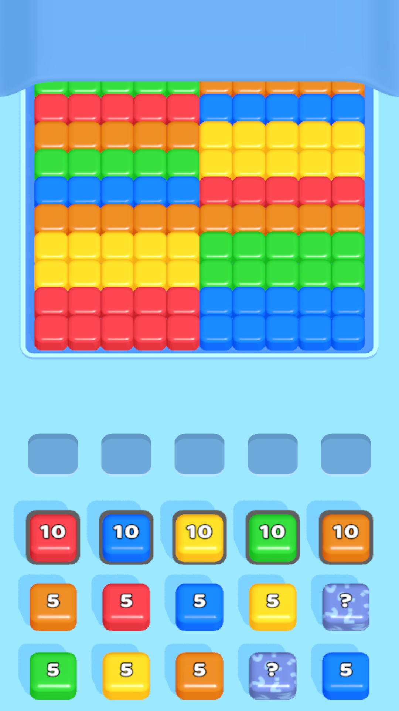
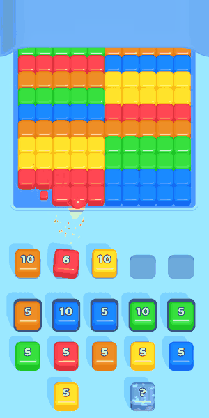
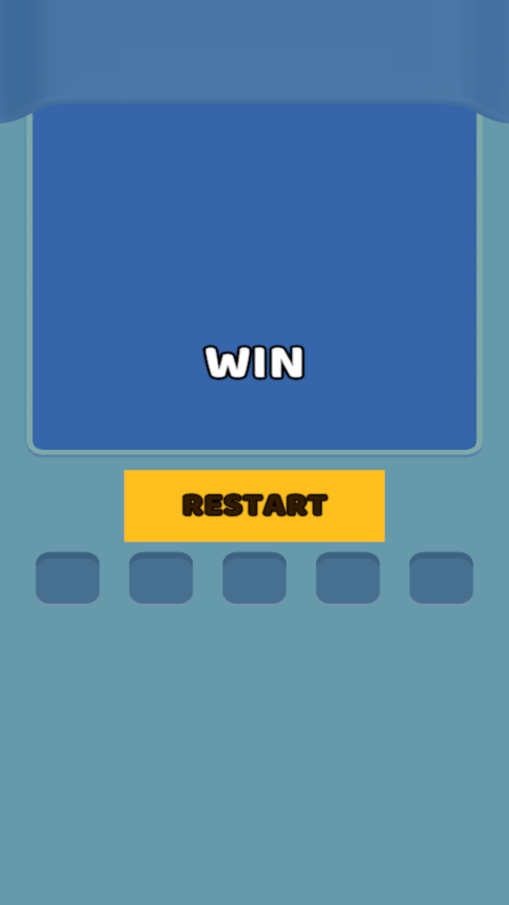
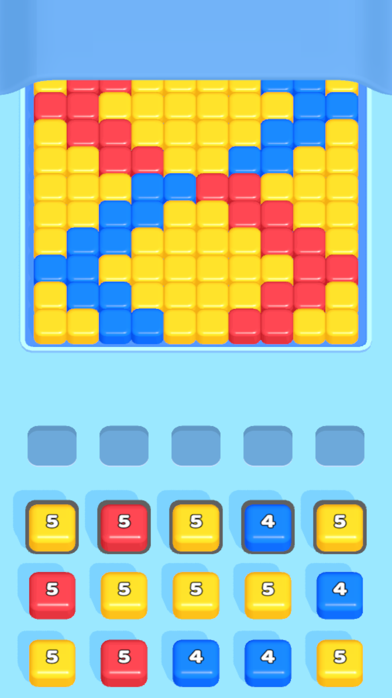
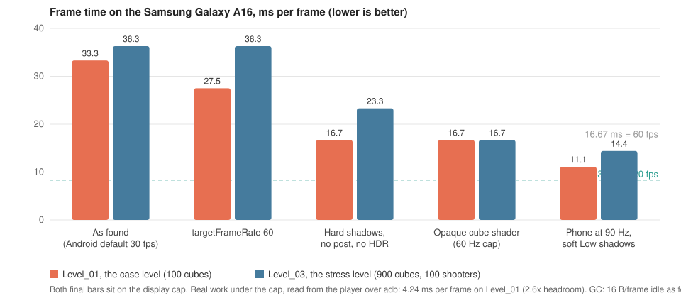

# This Is Blast, a case study

A from-scratch build of the *This is Blast!* core loop for the Apps game developer case:
a 10x10 cube grid, five slots, a shooter queue whose front row is tappable, hidden
shooters, WIN / LOST overlays with a restart, one JSON-driven sample level, no merge.

<p align="center">
  
  
  
</p>

Unity **6000.0.68f1**, URP 17. Open `Assets/00_GAME/Scenes/Game_Scene.unity` and press
Play; the sample level boots directly. There is no menu.

## What is in it

| The brief asks for | Where it lives |
|---|---|
| 10x10 grid, 5 slots, level-driven shooter columns, 2 queue rows visible | `LevelSpawner`, layout numbers as serialized structs |
| Tap the front row; the shooter runs to the next free slot and fires at front cubes of its colour | `GameDirector` -> `GameLoop.TrySelect` / `TryShoot` |
| Cubes behind a destroyed one flow toward the shooter | `BoardModel` front index + `CollapseTweens` |
| Out of ammo: leave and free the slot. Ammo but no target: stay | `SlotRow`, occupancy *is* the ammo |
| Hidden shooter, revealed on reaching the selectable row | `ShooterQueue.IsRevealed`, `LevelSpawner` |
| WIN / LOST overlay with a restart of the same level | `LevelEndViewModel` (R3) + `LevelEndView`, `SceneRestarter` |
| One JSON sample level: all five colours, a hidden shooter, solvable | `Assets/00_GAME/Levels/Level_01.json`, guarded by `LevelFileTests` |
| No merge | Not built, no hooks for it |

Juice, all measured from the original and then tuned by hand: the shooter's run, land
squash and counter punch, the yaw toward the target, the bullet with a trail in the
shooter's colour, the impact splash on the cube's top face, the cube's drawn death curve,
camera shake, two-voice audio with pitch jitter.

## Tests

| Suite | Count | Run |
|---|---|---|
| Unity EditMode, assembly `Blast.Tests` | 92 | Test Runner window, or `unity cmd run_tests --mode editor --filter "Blast.Tests" --filter_type assembly --async_tests true` |
| Level editor, `level-editor/logic.js` | 41 | `node --test level-editor/logic.test.js` |

Every rule of the game has a test; MonoBehaviours are tested through the Humble Object
pattern. Two tests guard things that break silently: `ArchitectureTests` reads the
`.asmdef` files on disk and fails when a layer references a layer above it, and
`LevelFileTests` parses every level in `Assets/00_GAME/Levels/` and fails when a colour
has fewer shots than cubes, the unwinnable level the brief warns about.

## Architecture

Six assemblies. The dependency direction is enforced by the asmdef references, not by
convention, and the test above keeps it that way.

```
Blast.Domain          pure C#: BoardModel, ShooterQueue, SlotRow, GameRules (noEngineReferences)
  ^
Blast.Application     GameLoop, the one use case: TrySelect / TryShoot, verdict, column states
  ^            ^              ^
Presentation   UI (MVVM, R3)  Infrastructure (LevelParser, PaletteData)
  ^
Blast.Bootstrap       GameLifetimeScope: the VContainer composition root

Blast.Diagnostics     PerfProbe / PerfSweep, development builds only, references no game layer
```

- **Domain** knows nothing about Unity, and nothing in it moves: the board keeps its
  authored colours and a per-column front index walks through them; the queue does the
  same. A slot is occupied exactly while its shooter has ammo, so "free slot" and "out of
  ammo" cannot disagree. `GameRules` is three pure functions: leftmost matching front,
  won, failed.
- **Application** is `GameLoop`. One call trades one shot for one cube and re-reads the
  verdict in the same call, so the overlay is never a move late. It asks *won* before
  *failed*, because an emptied board with a full slot row satisfies both. It has no notion
  of time; Presentation paces it.
- **Presentation** dresses the loop's answers. `GameDirector` turns a tap into `TrySelect`
  and runs each seated shooter's fire loop with UniTask; `LevelSpawner` owns every world
  position; views are humble and decide nothing. The column-state handshake
  (`LockColumn` / `MarkSettling` / `MarkSettled`) exists because the domain removes a cube
  the instant it is shot, while the bullet is still in the air on screen.
- **UI** is one MVVM pair on R3 streams. **Infrastructure** is the trust boundary: the
  parser refuses every malformed file with a `FormatException` that names the location.
- **Bootstrap** registers the parsed models, `GameLoop`, the palette adapter and the scene
  components; VContainer builds the graph and calls each component's `[Inject] Construct`.

## Levels

```json
{
  "boardLayers": [ { "rows": ["RRRRRBBBBB", "..."] } ],
  "slotCount": 5,
  "shooterColumns": [ { "shooters": [ { "color": "R", "ammo": 10, "hidden": false } ] } ]
}
```

Rows are listed front row first, one letter per column (`Y R B G O`); each shooter column
front first; `hidden` conceals the colour until the shooter reaches the front row.
`level-editor/index.html` (no dependencies, double-click) paints a board, autofills a
queue and runs the same checks as the tests. It writes straight into the Levels folder in
Chromium browsers; everywhere else it downloads the file, and *JSON kopyala* / *JSON
yapıştır* move a level through the clipboard.

**The original game was read, not copied.** The shipped APK was opened with UnityPy to
measure what the look is made of (colour space, tints, ramp, shadow flags) and how its
2447 levels are stored. `Docs/Tools/convert_original_level.py` maps that schema onto this
one and proves the result under our rules with a search over the player's choices. The
original's level 4 ships whole as `Level_Original_04.json` (10x12, its own colours, checked
cube for cube against the running APK); the solver won it in the real game in 26 taps. Its
dense levels do not ship: without merge and with exact-fit ammo they are unsolvable or
path-dependent, and the doc shows the measurements. No mesh, texture, sound or code came
across. The reading, the numbers and the one cropped attempt that failed are in
[`Docs/ORIGINAL_GAME_ANALYSIS.md`](Docs/ORIGINAL_GAME_ANALYSIS.md).

<p align="center">
  
</p>

## Performance

Target: 120 FPS, 0 B of GC allocation per frame during play. Measured on a Samsung
Galaxy A16 over adb with a runtime probe, never in the Editor. Every step's before and
after, and every optimisation measured and *not* taken, is in
[`Docs/PERFORMANCE.md`](Docs/PERFORMANCE.md).



| | As found | Shipped |
|---|---|---|
| `Level_01` frame time | 33.3 ms (30 fps) | 11.1 ms, the phone's 90 Hz cap; 4.24 ms of real work under it |
| `Level_03` (900 cubes) frame time | 36.3 ms | 14.4 ms |
| GC allocation, idle | 16 B/frame | 0 B |
| GC allocation, firing | 78 B/frame | 0 B, about 11 B/frame of game allocation inside a burst |

What made the difference, in order of weight: removing the per-pixel alpha clip from the
cube shader, hard shadows, no post-processing or HDR, the frame-rate cap; then one reused
tween per moving view instead of a DOTween shortcut per move, a shared pool of collapse
tweens, pooled bullets and splashes, a fixed ring of audio voices, `sharedMaterial`
everywhere. What did not, and was therefore not taken: GPU instancing, a smaller shadow
map, pooling the cubes, render scale, Optimized Frame Pacing.

## Decisions, including what was left out

- **No merge.** The brief forbids it; there are no hooks for it either.
- **No save system.** One level replays after a win as after a loss.
- **Cubes are instantiated once and destroyed on death, not pooled.** Pooling them changed
  nothing on the device.
- **`GameDirector` has no unit tests.** Everything it decides is a `GameLoop` call, and
  `GameLoop` is fully tested; what remains is async choreography, verified in Play for
  every change. Splitting it into presenters was deferred: the case ranks bug-free above
  architecture.
- **Static `GameRules`, no interfaces on the domain types.** Nothing ever substitutes them.
- **Every tuning number is a serialized struct with a `Defaults` initializer**, so a retune
  never recompiles and a new field arrives with a value instead of a zero.
- **The original's level was taken whole or not at all.** Cropped to 10x10 it passed the
  simulator and lost in the real game; the sample level stays hand-authored.

## Repository map

```
Assets/00_GAME/Scripts/<Layer>/    one asmdef per layer, tests in Scripts/Tests/EditMode
Assets/00_GAME/Levels/             the JSON levels: Level_01 is the case, 02-04 stress, Level_Original_04
Assets/00_GAME/Scenes/Game_Scene   the one scene
level-editor/                      the HTML level editor and its node tests
Docs/PLAN.md                       the design plan: mechanics, art and animation bibles, architecture
Docs/PERFORMANCE.md                the performance ledger
Docs/ORIGINAL_GAME_ANALYSIS.md     what was measured in the original and what it decided
Docs/This_Is_Blast_Vaka_Raporu.pdf the case report in Turkish, built by Docs/Tools/build_case_report.py
Docs/Tools/                        level generators, the APK extraction and conversion tools
.claude/notes/case-status-log.md   the build record, chunk by chunk
```
